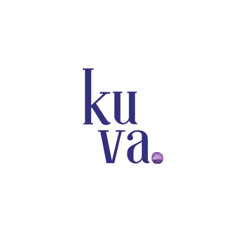
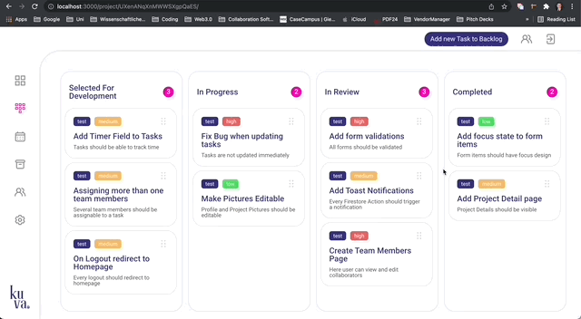

<div id="top"></div>

<!-- PROJECT SHIELDS -->
[![LinkedIn][linkedin-shield]][linkedin-url]


<!-- PROJECT LOGO -->
<br />
<div align="center">
  <a href="https://github.com/othneildrew/Best-README-Template">
    
  </a>

  <h3 align="center">kuva.</h3>
  <h4 align="center">The project management Tool for small teams and solo developers</h4>

  <p align="center">
    Interactive Kanban web application
    <br/>
    Developed by <a href="https://www.linkedin.com/in/maxim-buz-17a2a717b/">Maxim Buz</a>
    <br/>
    <a href="https://kuva.vercel.app/">View Demo</a>
  </p>
</div>


<!-- TABLE OF CONTENTS -->
<details>
  <summary>Table of Contents</summary>
  <ol>
    <li>
      <a href="#about-the-project">About The Project</a>
      <ul>
        <li><a href="#built-with">Built With</a></li>
      </ul>
    </li>
    <li><a href="#usage">Usage</a></li>
    <li><a href="#contact">Contact</a></li>
  </ol>
</details>


<!-- ABOUT THE PROJECT -->
## About The Project

[![Product Name Screen Shot][product-screenshot]](https://example.com)

The **kuva.** project management platform is was my first elaborate personal project.

Here are the currently implemented main use-cases:
* Create, manage, update and delete tasks
* Interact with task statuses via user-friendly drag and drop functionality
* Invite coworkers and collaborate on projects using Google Accounts as sign-in method

<p align="right">(<a href="#top">back to top</a>)</p>


### Built With

This application has been built and styled without using any pre-built component frameworks, only by using following technologies:

Front-End:
* [TypeScript](https://www.typescriptlang.org/)
* [React.js](https://reactjs.org/)
* [React Query](https://react-query.tanstack.com/)
* [Styled Components](https://styled-components.com/)

Back-End with Authentication, Database and Filestorage:
* [Firebase](https://firebase.google.com/)


<p align="right">(<a href="#top">back to top</a>)</p>


### Installation

1. ```sh
   Coming Soon...
   ```

<p align="right">(<a href="#top">back to top</a>)</p>


<!-- USAGE EXAMPLES -->
## Usage examples

See the prototype in action with some of these usage examples!

1. Interacting with Kan Ban Board


2. Inviting Co-Workers (already signed-up or invite via email possible)


3. Adding Comments to Tasks


<p align="right">(<a href="#top">back to top</a>)</p>


<!-- CONTACT -->
## Contact

Maxim Buz - [LinkedIn](https://www.linkedin.com/in/maxim-buz-17a2a717b/) - mbuz.maxim@gmail.com

Project Link: [https://github.com/MaximBuz/kuva/](https://github.com/MaximBuz/kuva/)

<p align="right">(<a href="#top">back to top</a>)</p>


<!-- MARKDOWN LINKS & IMAGES -->
<!-- https://www.markdownguide.org/basic-syntax/#reference-style-links -->
[linkedin-shield]: https://img.shields.io/badge/-LinkedIn-black.svg?style=for-the-badge&logo=linkedin&colorB=555
[linkedin-url]: https://www.linkedin.com/in/maxim-buz-17a2a717b/
[product-screenshot]: public/screenshot.png
